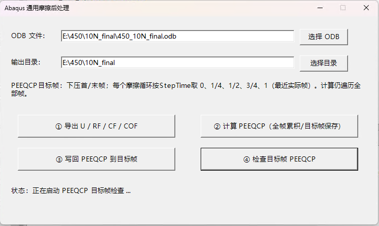

# Abaqus-CPFEM-PostTools

**English** | [简体中文](README.zh-CN.md)

[](https://github.com/yline0829/Abaqus-CPFEM-PostTools/releases/latest)
[](LICENSE)


Cross-platform post-processing tools for **Abaqus/CPFEM**, focused on selective ODB extraction, ParaView visualization, grain-resolved field analysis, GND evolution, tribological history data, and PEEQCP reconstruction.

> This project is independent of Dassault Systèmes. Abaqus is required to read/write ODB files; no Abaqus libraries or binaries are distributed here.

## Download

For most users, the recommended entry point is the **latest GitHub Release**:

**[Download the latest release](https://github.com/yline0829/Abaqus-CPFEM-PostTools/releases/latest)**

Available packages currently include:

- **Windows — Abaqus Data Exporter**
- **Windows — Abaqus CPFEM Postprocess**
- **Linux — Combined Tools**

The repository itself is the maintainable source tree; packaged ZIP files are distributed through **Releases**.

## Overview

The toolkit currently contains two complementary applications:

| Application | Main purpose |
|---|---|
| **Abaqus Data Exporter** | Selective ODB → VTU/PVD export, ParaView-ready fields, GrainID, Initial IPF, Mises, GND differences, grain-level extrema, and History/Curve data |
| **Abaqus CPFEM Postprocess** | RP history extraction and frame-by-frame PEEQCP reconstruction/write-back using a physically matched StepTime sampling schedule |

## Screenshots

### 1. Abaqus Data Exporter

Select an ODB, instance, grain region, analysis steps, frames, and output variables. Multi-step ParaView time-series export supports arbitrary Step/Frame states without converting the entire ODB.

<p align="center">
  
</p>

### 2. Abaqus CPFEM Postprocess

The CPFEM utility handles RP history data and PEEQCP reconstruction. PEEQCP is accumulated through all stored frames while selected physical states are retained for comparison and optional write-back.

<p align="center">
  
</p>

### 3. ParaView — reconstructed PEEQCP

Exported PVD/VTU data can be opened directly in ParaView. The example below shows the reconstructed PEEQCP field in a friction/CPFEM model.

<p align="center">
  
</p>

### 4. ParaView — initial crystallographic orientation

The Data Exporter can reconstruct the initial grain orientation from per-grain material Euler angles in the INP and export an HCP-Ti IPF-related field for ParaView visualization.

<p align="center">
  
</p>

## Applications

### Abaqus Data Exporter

- Selective ODB → **VTU/PVD** export for ParaView
- Large-ODB workflow: read only selected instances, sets, steps, frames, and fields
- `GrainID` reconstruction and `<All Grains>` selection
- Derived **von Mises stress**
- **Initial HCP-Ti IPF** from per-grain material Euler angles in the INP
- Field extrema / grain correlation analysis
- Top-N / extreme-band grain-only VTU export
- History/curve CSV export
- 18-slip-system GND evolution from `gnd_field.dat` vs. `SDV11–SDV28`
- Sliding-start GND increment using the first sliding frame or the previous step's last frame as reference

### Abaqus CPFEM Postprocess

- RP history extraction: `U1/U2`, `RF1/RF2`, `CF1/CF2`, COF
- Frame-by-frame PEEQCP reconstruction from `Fp = SDV1–SDV9`
- Target-state saving:
  - indentation/normal-loading step: first + last frame
  - each sliding cycle: **T0/T25/T50/T75/T100 by StepTime**
- Nearest actual ODB frame is selected when a target StepTime is not stored exactly
- PEEQCP can be written back to those selected ODB frames
- Linux live progress logging and completion notifications

## Repository layout

```text
src/
  data_exporter/
    backend/     # Abaqus-Python ODB backends
    windows/     # PowerShell/WPF GUI
    linux/       # Python/Tk GUI
  postprocess/
    backend/     # history + PEEQCP backend
    windows/     # PowerShell GUI
    linux/       # Python/Tk GUI
packaging/linux/ # desktop installer/uninstaller
scripts/         # release builder
docs/            # methods and installation notes
examples/        # small, non-proprietary examples
```

## Requirements

- A licensed Abaqus installation providing `odbAccess`
- An Abaqus command such as `abaqus` or `abq2024`
- ParaView for VTU/PVD visualization
- Windows: Windows PowerShell / WPF
- Linux GUI: Python 3 + Tkinter

For containerized Abaqus on Linux, set the GUI's **Abaqus command** to the full prefix, for example:

```bash
singularity exec /path/to/abaqus2024.sif /opt/run_abaqus.sh
```

The application appends `python <backend.py> ...` automatically.

## Important model assumptions

Some CPFEM-derived functions are model-specific. In particular, the current GND mapping assumes:

- `SDV11–SDV28` are the 18 slip-system GND densities
- `gnd_field.dat` column 1 is Abaqus element label
- columns 2–10 are nine initial GND/Burgers-direction densities
- each direction is split equally between its paired slip systems

See [docs/gnd_mapping.md](docs/gnd_mapping.md) before using the GND tools with another UMAT.

PEEQCP reconstruction assumes `SDV1–SDV9` contain `Fp` in the documented Fortran column-major mapping. See [docs/peeqcp.md](docs/peeqcp.md).

## Installation

- [Windows](docs/install-windows.md)
- [Linux](docs/install-linux.md)

For normal users, downloading a packaged asset from **Releases** is recommended.

## Build release packages

From a normal Python 3 environment:

```bash
python scripts/build_release.py
```

Generated ZIP files are written to `dist/` and are intentionally ignored by Git.

## Development status

This is the first public source release (`v0.1.0`). The project grew from an internal research post-processing workflow and is being generalized incrementally. Please report model/version compatibility issues through GitHub Issues.

## License

MIT License. See [LICENSE](LICENSE).
